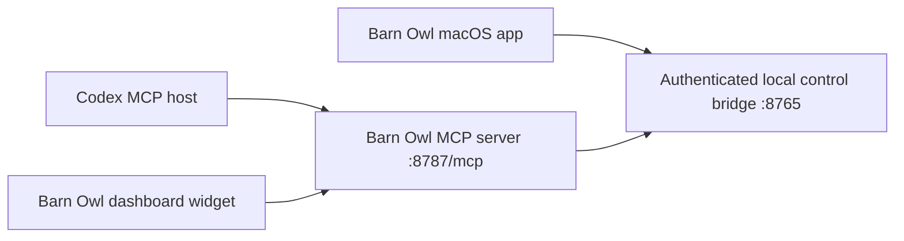

# Barn Owl Codex MCP App

## Purpose

The Barn Owl MCP app is a Codex-facing interactive UI over the existing Barn Owl
foundation, not a parallel product stack. The native macOS app remains the
system of record for capture state, meeting storage, processing jobs, notes, and
permissions. The MCP layer adds:

- a loopback MCP endpoint at `http://127.0.0.1:8787/mcp`
- a Codex widget resource at `ui://widget/barnowl-dashboard-v1.html`
- tools that proxy into Barn Owl's authenticated local control bridge
- a dashboard UI aligned with the existing Barn Owl visual language

## Architecture



The MCP server reads the existing Barn Owl bridge token from local app support
state or `BARNOWL_BRIDGE_TOKEN`, then forwards typed commands to the running app.
The MCP endpoint itself is intended for local Codex use and binds to localhost.

## Target Product Architecture

Barn Owl should evolve around three layers:

1. **Native Barn Owl runtime**
   - owns permissions, capture devices, recording/session lifecycle, persistence,
     durable jobs, notes, updates, and diagnostics
   - remains the system of record for state and all mutating business logic
2. **Thin Codex MCP app**
   - exposes typed tools and interactive UI resources to Codex
   - renders Codex-native meeting control surfaces from bridge-backed state
   - keeps local UI orchestration separate from native app ownership
3. **Future Codex capability adapter**
   - remains a focused integration seam for Codex-specific entry points and APIs
     as the Codex MCP Capabilities layer stabilizes internally
   - should absorb future direct-launch, persistent-surface, richer host-context,
     and capability-registration behavior without moving core Barn Owl logic out
     of the native runtime

This keeps Barn Owl aligned with the emerging internal Codex MCP Apps direction
without overfitting to unstable host APIs before they are ready.

The current implementation keeps that seam in
`mcp-app/lib/codex-capability-adapter.js`. Today it centralizes Codex-facing
resource metadata, app-visible tool metadata, and initialization capability
shape. Future Codex capability SDK integration should land there first instead
of spreading host-specific conditionals across the MCP server.

## Implemented Surface

### Render/data tools

- `render_barnowl_dashboard`
- `get_dashboard_snapshot`

### Capture and meeting control

- `start_recording`
- `stop_recording`
- `set_audio_sources`
- `add_context`
- `open_settings`
- `open_notes_folder`

### Meeting retrieval and notes

- `list_recent_meetings`
- `search_meetings`
- `get_meeting`
- `get_meeting_summary`
- `get_meeting_actions`
- `get_meeting_notes`
- `ask_notes`
- `update_notes`

### Recovery and diagnostics

- `get_context_review`
- `apply_context_review`
- `dismiss_context_review`
- `list_jobs`
- `retry_job`
- `export_diagnostics`
- `check_permissions`

## UI Coverage

The Codex widget currently includes:

- live meeting header and recording state
- microphone/system-audio toggles
- start/stop recording actions
- realtime transcript preview
- context attach workflow
- recent meetings and search
- meeting summary/actions pane
- readiness, permissions, background-job, and diagnostics affordances
- native handoff buttons for Settings and the notes folder
- bridge-first MCP Apps transport for `ui/initialize` and `tools/call`, with the
  host `window.openai` compatibility layer retained as a fallback
- host-aware resume/display behavior, including widget-state restoration,
  `openai:set_globals` updates, and fullscreen requests with an explicit button
  fallback when the host keeps the app inline

The styling intentionally follows Barn Owl's existing palette and restrained
surface treatment rather than inventing a separate app language.

## Run Locally

1. Launch Barn Owl so the control bridge is available.
2. Start the MCP server:

   ```sh
   cd mcp-app
   node server.js
   ```

3. Register it with Codex:

   ```sh
   scripts/register-codex-mcp-app.sh
   ```

   The helper leaves an existing correct `barnowl` registration alone, adds it
   when missing, and requires `--replace` before overwriting a conflicting local
   registration.

4. In Codex, invoke the Barn Owl MCP app and render
   `render_barnowl_dashboard`.

For Codex-driven launch flows, the `barnowl` CLI now attempts to start the MCP
server automatically at the same time it auto-launches Barn Owl. This is
best-effort and intentionally non-blocking:

- it no-ops when `http://127.0.0.1:8787/` is already serving
- it resolves the MCP app from the installed Barn Owl app bundle or the local repo
- it requires a local `node` binary
- it can be disabled with `BARNOWL_MCP_AUTOSTART=0`

## Verification

Use the focused MCP test suite:

```sh
cd mcp-app
node --test tests/*.test.js
```

Use the repo-wide verification gate:

```sh
scripts/verify.sh
```

`scripts/verify.sh` runs the hosted macOS test suites through
`scripts/run-hosted-app-tests.sh` plus the focused MCP app Node test suite. The
hosted runner launches the unsigned built Barn Owl host app directly with the
XCTest injection libraries from the dedicated hosted DerivedData directory. That
keeps the release gate on the app-hosted bundle without depending on the flaky
outer `xcodebuild test-without-building` harness.

The production/release gates also treat the MCP app as a release artifact:

- source handoff archives include `mcp-app/` and this design document
- release verification requires bundled MCP server/client/widget resources
- manual QA evidence records whether the installed app includes the MCP app
- installed CLI/Codex QA boots the bundled MCP server and verifies initialize,
  tool listing, and widget resource discovery

## Production Acceptance Criteria

The Barn Owl Codex MCP App surface is considered internally production-ready only
when all of the following are true:

- native Barn Owl remains the single owner of capture, permissions, persistence,
  and mutating state transitions
- the MCP app can render and operate through localhost-only, token-backed bridge
  calls without duplicating native business logic
- widget/UI state restores cleanly enough for Codex usage and fails visibly when
  Barn Owl or the bridge is unavailable
- source handoff, release packaging, and release verification include the MCP app
  by default
- installed-app QA proves the bundled MCP server and UI resource metadata are
  actually runnable from the shipped bundle
- the app can later adopt Codex-specific capability APIs through a bounded adapter
  layer rather than a cross-cutting rewrite
- widget resume restores selected meeting context and search intent through the
  host widget state contract instead of returning to a half-empty shell

## Production Readiness Notes

- The MCP app reuses the existing native control bridge and avoids duplicating
  product logic.
- Mutating operations still terminate in Barn Owl's typed command handlers.
- The widget is decoupled from tool execution through a render tool plus focused
  data/control tools.
- The resource uses `text/html;profile=mcp-app`, and the render tool includes the
  current UI resource metadata expected by Codex-style MCP app hosts.
- The widget resource also declares a concise `openai/widgetDescription`, so
  Codex-style hosts can describe the dashboard without reverse-engineering the
  HTML resource.
- The MCP server is dependency-light and currently relies only on Node's standard
  library, which simplifies local internal deployment.
