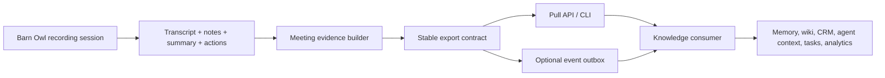

# Barn Owl Meeting Evidence Export Architecture

Last updated: 2026-05-17

## Purpose

Barn Owl should support a reusable design pattern:

> Barn Owl captures and structures meeting evidence. Downstream systems consume that evidence to build durable knowledge, workflows, automations, and memory.

This pattern must not assume one specific downstream product, repo, user, or knowledge system. It should support:

- personal operating systems
- team knowledge bases
- CRM/account systems
- task and project trackers
- agent runtimes
- analytics pipelines
- archival/search products
- future tools we have not named yet

The core architectural decision is:

> Barn Owl becomes a general-purpose **meeting evidence producer** with a stable export contract, while downstream systems remain responsible for their own normalization, promotion, storage, ranking, and action policies.

This document is the design, build, and test brief for that outbound integration layer.

## Relationship to Existing Enrichment Architecture

Barn Owl already has an **inbound** enrichment architecture:

- external sources provide reference evidence to Barn Owl
- Barn Owl uses that evidence to improve meeting understanding and durable internal knowledge

This document defines the **outbound** side:

- Barn Owl emits standardized meeting evidence
- external consumers ingest it for their own downstream purposes

The two patterns are complementary:

| Direction | Pattern | Example |
| --- | --- | --- |
| External -> Barn Owl | Enrichment source registry | “Help Barn Owl understand who or what this meeting refers to.” |
| Barn Owl -> External | Meeting evidence export | “Let another system learn from or act on what this meeting produced.” |

They should share principles:

- normalized contracts
- provenance
- user scope
- policy awareness
- inspectability
- no source-specific hacks in the core product

## The General Design Pattern

### Pattern Name

**Evidence Producer / Knowledge Consumer**

### Intent

Separate:

1. **Event capture and event-local synthesis**
2. **Cross-event memory, business logic, or workflow promotion**

Barn Owl owns the first.
Consumers own the second.

### Why This Pattern Exists

Meeting capture products and durable knowledge products answer different questions.

Barn Owl should answer:

- What happened in this meeting?
- What transcript, summary, decisions, and actions can be grounded in the meeting?
- Is this meeting fully processed or still incomplete?
- What structured evidence can safely leave Barn Owl?

A downstream consumer should answer:

- Does this change a project record?
- Should this update a customer/account profile?
- Is this a durable decision or just a meeting remark?
- Should a task be created?
- Should a wiki page, memory card, or model context packet be updated?

These are different control planes. Mixing them in one product makes both weaker.

### Design Rule

Barn Owl exports **evidence**, not **final external truth**.

That distinction matters.

Examples:

- Good Barn Owl export:
  - “This meeting summary contains a candidate decision: pricing floor should remain at X.”
- Bad Barn Owl export:
  - “The organization’s pricing policy is now X.”

The latter may be true. It is simply not Barn Owl’s job to declare that on behalf of an external system.

## Product Thesis

Barn Owl should become:

- the best system for capturing meeting truth
- the cleanest source of meeting-derived evidence for other systems
- the most interoperable recording/transcription layer in a broader agent stack

Barn Owl should **not** become:

- every user’s wiki
- every organization’s durable memory graph
- every workflow engine’s source of promotion decisions
- a hardcoded adapter farm for one downstream product at a time

## System Boundary

### Barn Owl Owns

- audio/session capture
- transcript lifecycle
- diarized or speaker-aware outputs where available
- meeting metadata
- meeting-local context
- generated notes
- summary
- action items
- decisions
- open questions
- extracted meeting facts
- artifact readiness
- job and repair state
- immutable or stable pointers back to meeting-native artifacts
- exportability of meeting evidence

### Downstream Consumers Own

- ingestion checkpoints and cursors
- normalization into their domain model
- entity linking beyond what Barn Owl provides
- promotion policies
- durable memory records
- cross-source reconciliation
- ranking and retrieval
- alerts, task creation, CRM updates, wiki updates, and automations
- retention policies outside Barn Owl

## Target Architecture



## Core Requirements

Barn Owl’s export layer should satisfy six requirements:

1. **Stable contract**
   Consumers should depend on an explicit versioned schema, not on private database details or markdown scraping.

2. **Complete enough for downstream reasoning**
   Export should include raw pointers, structured derived fields, and readiness state.

3. **Safe by default**
   Export should be explicit about what content is copied versus referenced.

4. **Idempotent and cursor-friendly**
   Consumers need to sync without duplicate creation or fragile ad hoc dedupe.

5. **Observable**
   Developers and operators should be able to inspect what Barn Owl exported and why.

6. **Consumer-agnostic**
   The contract must work for many downstream systems without encoding one product’s worldview.

## Export Model

## Meeting Evidence Envelope

Barn Owl should expose a canonical **Meeting Evidence Envelope**.

Illustrative shape:

```json
{
  "schemaVersion": "1.0",
  "evidenceType": "barnowl.meeting",
  "source": {
    "producer": "barnowl",
    "producerVersion": "app-version-or-build",
    "tenantScope": "local-user-or-org-scope"
  },
  "meeting": {
    "id": "8B2A...",
    "stableKey": "barnowl:meeting:8B2A...",
    "externalID": null,
    "title": "Acme renewal review",
    "meetingType": "Customer Review",
    "startedAt": "2026-05-17T17:00:00Z",
    "endedAt": "2026-05-17T17:45:00Z",
    "updatedAt": "2026-05-17T18:02:00Z"
  },
  "participants": [
    {
      "displayName": "Jane Doe",
      "roleHint": "participant",
      "speakerLabel": "Speaker 2"
    }
  ],
  "artifacts": {
    "transcript": {
      "pointer": "barnowl:meeting:8B2A...#transcript",
      "ready": true,
      "text": "Speaker 1: We should hold price. Speaker 2: Agreed..."
    },
    "notes": {
      "pointer": "barnowl:meeting:8B2A...#notes",
      "ready": true
    },
    "summary": {
      "pointer": "barnowl:meeting:8B2A...#summary",
      "ready": true
    },
    "actions": {
      "pointer": "barnowl:meeting:8B2A...#actions",
      "ready": true
    }
  },
  "derived": {
    "summary": {
      "overview": "The team aligned on renewal posture and escalation rules."
    },
    "decisions": [
      "Do not discount below X without escalation."
    ],
    "actionItems": [
      "Owner to send revised follow-up by Friday."
    ],
    "openQuestions": [
      "Whether procurement needs revised paperwork."
    ],
    "meetingFacts": {
      "customers": ["Acme"],
      "organizations": ["Acme"],
      "projects": ["Renewal"],
      "goals": ["Close renewal without policy exception"]
    },
    "candidateEntities": [
      {
        "kind": "organization",
        "text": "Acme",
        "confidence": 0.94
      }
    ]
  },
  "processing": {
    "state": "complete",
    "transcriptReady": true,
    "notesReady": true,
    "summaryReady": true,
    "usedFallbackSummary": false,
    "repairRecommended": false,
    "lastSuccessfulProcessingAt": "2026-05-17T18:02:00Z"
  },
  "provenance": {
    "sourceOfTruth": "barnowl",
    "contentPolicy": "structured_outputs_transcript_and_pointers",
    "generatedAt": "2026-05-17T18:02:05Z"
  }
}
```

## Design Notes on the Envelope

### 1. Stable key

Every export should include a stable dedupe key:

- `barnowl:meeting:<meeting-id>`

This is the external consumer’s idempotency anchor.

### 2. Transcript and summary are part of the default evidence payload

The export contract should include:

- copied summary text
- copied raw transcript text
- artifact pointers back to Barn Owl-native records

That makes the payload immediately useful to serious downstream consumers without
requiring a second lookup round trip for every substantive use case.

This does **not** mean transcript export is unconditional. Transcript inclusion
must still be governed by first-class export policy. The contract should support
the transcript field as a standard shape, while policy determines whether it may
be populated in a given environment.

### 3. Derived fields are evidence candidates

Exported decisions, actions, and entity hints are valuable.
They are not externally authoritative by default.

Consumers decide whether to:

- promote
- ignore
- reconcile
- ask for review

### 4. Processing state is first-class

Consumers must not infer readiness by poking at content fields.

They should be able to tell:

- meeting captured but still processing
- notes ready but summary not ready
- summary used fallback path
- repair is recommended
- meeting is stable enough for ingestion

## Export Surfaces

Barn Owl should support two interoperable export surfaces.

## Surface 1: Pull-Based CLI / API

This is the minimum viable integration surface.

Suggested commands:

```bash
barnowl meeting evidence <meeting-id> --format json
barnowl meetings evidence --since <timestamp> --format json
barnowl meetings evidence --cursor <cursor> --limit 100 --format json
```

Optional filters:

```bash
--processing-state complete
--summary-ready true
--include transcript-segments
--include notes-body
```

Benefits:

- easy to build
- easy to debug
- easy for local automations and external tools
- consistent with the existing Barn Owl CLI model

### Sync semantics

Barn Owl should support **both** sync modes:

- `--since <timestamp>` for human use, ad hoc scripts, and straightforward local automation
- `--cursor <opaque-token>` for production-grade incremental sync

Timestamp sync is easier to reason about and should remain useful forever. Opaque
cursors are the stronger contract for reliable integration because Barn Owl, not
the consumer, controls the exact continuation point. This prevents edge cases
around equal timestamps, partial batch failures, and replay boundaries.

Current implementation status:

- `--since <timestamp>` exists as the first incremental surface.
- Timestamp sync is inclusive on `updatedAt`, ordered by `(updatedAt, id)`, and
  returns page metadata including `requestedSince`, `nextSince`, `limit`,
  `returnedCount`, and `hasMore`.
- That makes it suitable for transparent scripting and polling loops that can
  tolerate duplicate-safe replay at equal timestamps.
- `--cursor <opaque-token>` now exists as the stricter continuation layer.
- Cursor tokens resume strictly after the last exported `(updatedAt, meetingID)`
  position, preserving deterministic ordering across equal timestamps.
- Timestamp pages emit `nextCursor`, so consumers can bootstrap with `--since`
  and then switch to cursor mode for exact continuation.

## Surface 2: Durable Export Outbox

This is the better production integration path for near-real-time consumers.

Barn Owl should be able to record durable export events such as:

- `meeting.created`
- `meeting.processing_completed`
- `meeting.summary_repaired`
- `meeting.updated`
- `meeting.deleted`
- `meeting.purged`

Each event should include:

- event id
- event type
- occurred at
- meeting stable key
- export schema version
- minimal envelope or retrieval pointer

Consumers can:

- poll the outbox
- checkpoint processed events
- avoid full rescans
- respond quickly to changes

The outbox should not be a product-specific webhook first.
Start with a durable local/event-table or CLI-readable abstraction. Add push transports later if justified.

Deletion and purge events are required because downstream systems may already
hold exported copies. A tombstone-style event is how Barn Owl communicates that
source data was removed so consumers can reconcile, remove, archive, or flag
their own copies intentionally.

Current implementation status:

- Barn Owl now has durable `meeting_export_events` storage with schema migration.
- The persistence layer can read event windows by timestamp or strict cursor-style
  `(occurredAt, eventID)` continuation.
- Consumers can poll the outbox through:

```bash
barnowl meetings evidence-events --since <timestamp> --format json
barnowl meetings evidence-events --cursor <cursor> --limit 100 --format json
```

- Current exported event classes are:
  - `meeting.created`
  - `meeting.processing_completed`
  - `meeting.summary_repaired`
  - `meeting.updated`
  - `meeting.deleted`
  - `meeting.purged`
- Snapshot-bearing lifecycle/update events can include a serialized meeting
  evidence envelope inline. Tombstones remain compact and carry the stable meeting
  key plus an explicit reason.
- Delete and temporary-audio purge flows emit tombstone records into the outbox
  store and those records are cursor-pollable like every other event.

## Recommended Build Strategy

## Phase 1: Canonical Export Contract

Goal:

- Define and implement one consumer-agnostic evidence envelope.

Build:

- schema model
- serializer
- stable key logic
- processing state mapping
- artifact pointer model
- raw transcript inclusion in the standard export shape
- export contract tests

Likely app surfaces:

- `BarnOwlMeetingEvidenceEnvelope`
- `BarnOwlMeetingArtifactPointer`
- `BarnOwlMeetingProcessingExportState`

Acceptance:

- one meeting can be exported deterministically from app state
- export is stable across repeated reads
- schema version is present
- dedupe key is present

## Phase 2: CLI Read Surface

Goal:

- Make the export usable by external consumers without privileged internal coupling.

Build:

- `meeting evidence <id>`
- `meetings evidence --since`
- `meetings evidence --cursor`
- explicit include/exclude flags for optional transcript segment arrays and future payload controls

Acceptance:

- consumers can sync meetings incrementally
- no direct DB coupling is needed
- malformed or incomplete meetings still return explicit machine-readable processing state
- transcript text is present whenever export policy allows it

## Phase 3: Export State and Repair Semantics

Goal:

- Make readiness and retry states integration-grade.

Build:

- normalized export processing states
- `usedFallbackSummary`
- `repairRecommended`
- “safe to ingest” or equivalent derived signal
- export of repaired-summary updates

Acceptance:

- downstream consumers can distinguish:
  - not ready
  - ready
  - ready with caveat
  - requires repair/retry

## Phase 4: Durable Export Outbox

Goal:

- Support production-grade incremental consumption without constant full scans.

Build:

- export event records
- event lifecycle
- cursoring
- event replay
- idempotent consumer contract
- tombstone events for deleted and purged meetings

Acceptance:

- consumers can resume from a cursor
- duplicate processing is preventable
- repaired or updated meetings generate new events

## Phase 5: Reference Consumer and Docs

Goal:

- Prove the contract works beyond one private integration.

Build:

- one small reference consumer script or sample integration
- docs for a knowledge consumer
- docs for a workflow/action consumer

Acceptance:

- at least two distinct consumer patterns are documented
- the contract remains generic across both

Current reference consumer:

```bash
python3 scripts/reference-meeting-evidence-consumer.py \
  --since 1970-01-01T00:00:00Z \
  --checkpoint /tmp/barnowl-meeting-export-checkpoint.json
```

The script polls `meeting_export_events`, checkpoints the returned continuation
cursor, and normalizes downstream handling into two generic actions:

- `upsert` for created/completed/repaired/updated meeting evidence
- `tombstone` for deleted or purged meeting evidence

It intentionally stops there. Durable memory promotion, CRM changes, task
creation, and ranking remain consumer-owned behaviors.

## Consumer Patterns to Support

The export should work for multiple downstream archetypes.

### 1. Durable Knowledge Consumer

Purpose:

- turn recurring meeting evidence into durable memory

Needs:

- summary
- decisions
- actions
- entity hints
- pointers to source artifacts
- strong readiness state

### 2. Workflow Automation Consumer

Purpose:

- create tasks, reminders, CRM updates, or follow-up drafts

Needs:

- action items
- owners if available
- dates if available
- meeting metadata
- transcript or notes pointers for verification

### 3. Search/Archive Consumer

Purpose:

- index meetings into another retrieval system

Needs:

- title
- timestamps
- participant metadata
- search text or pointers
- artifact availability

### 4. Analytics Consumer

Purpose:

- measure meeting patterns over time

Needs:

- meeting type
- duration
- participant counts
- action item counts
- decision counts
- processing state

### 5. Agent Runtime Consumer

Purpose:

- inject meeting-grounded evidence into later reasoning

Needs:

- compact evidence packets
- source pointers
- recency
- confidence
- explicit caveats

## Content and Privacy Policy

Exports should be policy-driven.

Possible export modes:

- `metadata_only`
- `summary_transcript_and_pointers`
- `structured_outputs_transcript_and_pointers`
- `full_text_allowed`

Recommended default:

- `structured_outputs_transcript_and_pointers`

That gives downstream systems the evidence they usually need immediately, while
still keeping transcript export under explicit product policy rather than leaving
it to accidental call-site behavior.

## Testing Strategy

This export layer needs more than happy-path snapshot tests.

## Contract Tests

Validate:

- schema version present
- stable key present
- timestamps serialize correctly
- optional fields omitted or null consistently
- dedupe key remains stable
- exported readiness state matches meeting state

## State Matrix Tests

Cover meetings in states:

- recording
- stopped but not processed
- transcript ready only
- summary ready
- notes ready
- final processing complete
- fallback summary used
- summary repair queued
- summary repair succeeded
- summary repair failed

## Consumer Sync Tests

Simulate:

- first pull
- incremental pull
- repeated pull
- cursor resume
- duplicate prevention
- updated meeting after initial export

## Content Policy Tests

Verify:

- transcript text is present when policy allows it
- transcript text is omitted or blocked when policy disallows it
- summaries are included when policy allows them
- pointers are present where expected
- sensitive raw content is not leaked through accidental export fields

## CLI Tests

Verify:

- command decoding
- output format
- error codes
- not-found behavior
- filtering behavior
- cursor behavior

## Outbox Tests

Verify:

- event creation on final processing
- event creation on repairs/updates
- tombstone event creation on deletion and purge
- event ordering
- idempotent replay
- cursor persistence semantics

## Backward Compatibility Tests

Once consumers exist, verify:

- non-breaking schema additions remain readable
- breaking changes require schema version changes
- old consumers fail clearly rather than silently misreading data

## Design Risks

### Risk 1: Overfitting the Contract to One Consumer

If we design around one downstream product, the pattern becomes brittle.

Mitigation:

- keep the envelope evidence-centric
- document multiple consumer archetypes
- avoid product-specific field names

### Risk 2: Exporting Too Much Raw Content

Full transcript copying can become the accidental default.

Mitigation:

- pointer-first architecture
- explicit export policy modes
- tests preventing content leakage

### Risk 3: Consumers Ingest Before Meetings Are Stable

This creates churn and mistaken downstream updates.

Mitigation:

- first-class processing states
- “safe to ingest” semantics
- update events when artifacts are repaired or improved

### Risk 4: Barn Owl Rebuilds Workflow Logic It Should Not Own

If Barn Owl starts deciding which external wiki page or CRM field to update, the boundary is gone.

Mitigation:

- export evidence only
- keep consumer promotion logic outside Barn Owl

## Non-Goals

Do not use this initiative to:

- build a universal wiki inside Barn Owl
- build a CRM inside Barn Owl
- hardcode a specific external memory system
- make Barn Owl responsible for downstream promotion decisions
- require webhooks before pull-based export works
- require full transcript duplication for every consumer

## Finalized Design Decisions

1. `meeting evidence` returns **summary text and raw transcript text** as part of
   the standard evidence shape, subject to export policy.
2. Barn Owl supports **both** timestamp-based sync and opaque cursor-based sync.
   Timestamps serve human/script workflows. Cursors serve production integration.
3. Raw transcript text is part of v1 export. **Diarized transcript segment arrays
   are optional**, not default, and should be exposed through explicit include
   behavior when implemented.
4. Deleted and purged recordings should produce **tombstone-style export events**
   in the event/outbox phase.
5. Transcript export must be controlled by a **first-class export policy mode**,
   not by ad hoc local flags alone.
6. “Safe to ingest” should be represented as a **richer enum**, not a boolean.
7. Barn Owl should stabilize the portable core of `meetingFacts`
   (`meetingType`, `title`, `participants`, `customers`, `organizations`,
   `projects`, `goals`) and preserve extensibility for everything else.

## Recommended Near-Term Plan

### Build Now

1. Define `BarnOwlMeetingEvidenceEnvelope`
2. Implement `barnowl meeting evidence <id>`
3. Implement `barnowl meetings evidence --since <timestamp>`
4. Include summary text and raw transcript text under export policy
5. Export explicit processing/readiness state
6. Add contract/state-matrix/CLI tests

### Build Next

1. Evaluate whether push transports are justified beyond the pull/outbox model.
2. Expand downstream examples only when a real consumer needs deeper guidance.

## Readiness Eval

This initiative is ready when all are true:

1. Barn Owl exposes a documented, versioned meeting evidence envelope.
2. The envelope is consumer-agnostic and not coupled to one external product.
3. The CLI can export one meeting and incremental sets of meetings.
4. Consumers can sync idempotently using stable keys and cursors.
5. Processing/readiness state is explicit and machine-readable.
6. Summary and raw transcript content are exported whenever policy allows it.
7. Content-copying versus artifact-pointer policy is explicit and tested.
8. Summary repair and post-processing updates are visible to consumers.
9. Tombstone semantics are implemented for deleted and purged meetings in the
   outbox/event phase.
10. Tests cover contract shape, state transitions, CLI behavior, sync behavior,
    and content-policy safety.
11. At least two distinct downstream consumer patterns are documented.
12. Review finds no obvious boundary leak where Barn Owl takes over downstream promotion logic.

## Final Recommendation

Barn Owl should not be opinionated about what external systems do with meeting evidence.

Barn Owl should be opinionated about:

- producing that evidence cleanly
- versioning it
- preserving provenance
- exposing readiness truthfully
- making sync safe and boring

That is the reusable pattern.

If Barn Owl becomes the reliable evidence producer, other systems can become the durable memory, workflow, and ranking layers without forcing Barn Owl into their product shape.
